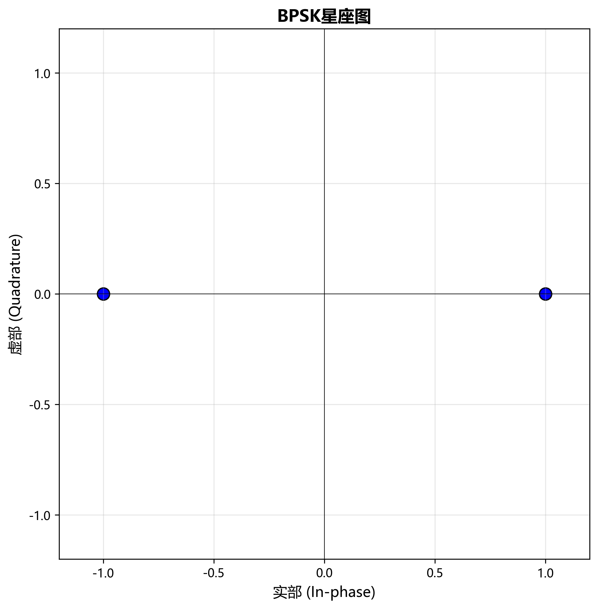
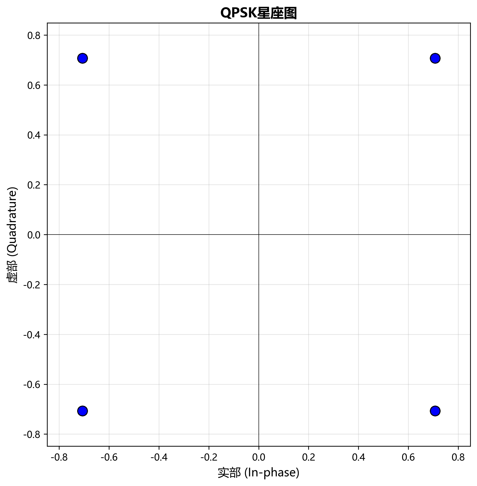
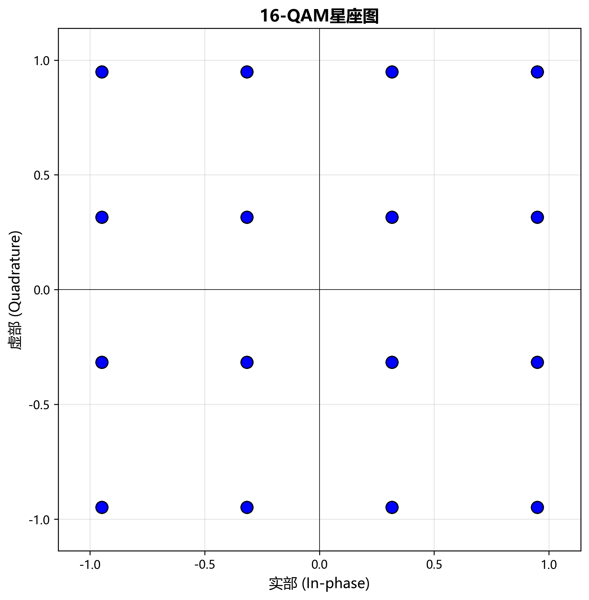

# 数字调制与解调实验报告

## 一、实验目的

1. 理解数字调制的基本原理：BPSK、QPSK 和 16-QAM。
2. 掌握调制信号的生成方法及其数学表达。
3. 理解星座图的含义及其与误码性能之间的关系。
4. 实现基本的解调算法。
5. 分析不同调制方式在噪声环境下的性能，包括 BER 与 SNR 的关系。
6. 学会使用 AI 编程助手辅助编程。
7. 熟悉 GitHub 代码协作流程。
8. 培养通过编程验证通信理论的能力。

## 二、实验内容与要求

1. 完成实验环境配置，安装 Python、NumPy、Matplotlib、Pytest 等相关依赖，并运行环境测试程序。
2. 在 `src/modulation.py` 中实现 BPSK、QPSK 和 16-QAM 三种调制函数。
3. 为不同调制方式生成对应的星座图，并保存到 `results` 文件夹中。
4. 在 `src/demodulation.py` 中实现 BPSK、QPSK 和 16-QAM 的解调函数。
5. 在 `src/performance_test.py` 中加入 AWGN 噪声，计算不同 SNR 条件下的 BER，并绘制 BER 性能曲线。
6. 将代码和实验结果上传至 GitHub，并通过 Pull Request 提交实验内容。

## 三、实验代码及数据结果

### 3.1 BPSK 调制与结果

BPSK 的映射规则为：比特 0 映射为 +1，比特 1 映射为 −1。

```python
def bpsk_modulate(bits):
    bits = np.array(bits, dtype=int)
    symbols = (1 - 2 * bits).astype(complex)
    return symbols
```



### 3.2 QPSK 调制与结果

```python
def qpsk_modulate(bits):
    bits = np.array(bits, dtype=int)
    if len(bits) % 2 != 0:
        raise ValueError("QPSK要求比特序列长度为偶数")
    bit_pairs = bits.reshape(-1, 2)
    symbols = []
    for b0, b1 in bit_pairs:
        if b0 == 0 and b1 == 0:
            symbol = (1 + 1j) / np.sqrt(2)
        elif b0 == 0 and b1 == 1:
            symbol = (-1 + 1j) / np.sqrt(2)
        elif b0 == 1 and b1 == 1:
            symbol = (-1 - 1j) / np.sqrt(2)
        else:
            symbol = (1 - 1j) / np.sqrt(2)
        symbols.append(symbol)
    return np.array(symbols, dtype=complex)
```



### 3.3 16-QAM 调制与结果

```python
def qam16_modulate(bits):
    bits = np.array(bits, dtype=int)
    if len(bits) % 4 != 0:
        raise ValueError("16-QAM要求比特序列长度为4的倍数")
    gray_map = {(0,0):3,(0,1):1,(1,1):-1,(1,0):-3}
    bit_groups = bits.reshape(-1,4)
    symbols = []
    for b0,b1,b2,b3 in bit_groups:
        i = gray_map[(b0,b1)]
        q = gray_map[(b2,b3)]
        symbols.append((i + 1j*q)/np.sqrt(10))
    return np.array(symbols)
```



### 3.4 解调实现

```python
def bpsk_demodulate(symbols):
    symbols = np.asarray(symbols, dtype=complex)
    return (np.real(symbols) <= 0).astype(int)
```

### 3.5 BER 性能分析


随着 SNR 增大，BER 逐渐降低。

## 四、实验分析与结论

实验表明：
- BPSK 抗噪声最强
- QPSK 性能折中
- 16QAM 频谱效率最高但抗噪弱
